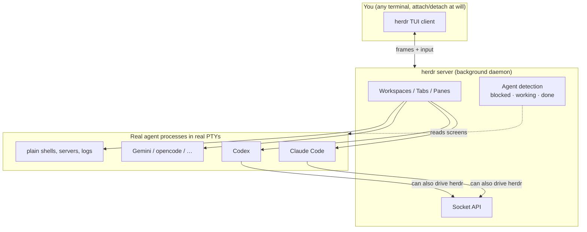
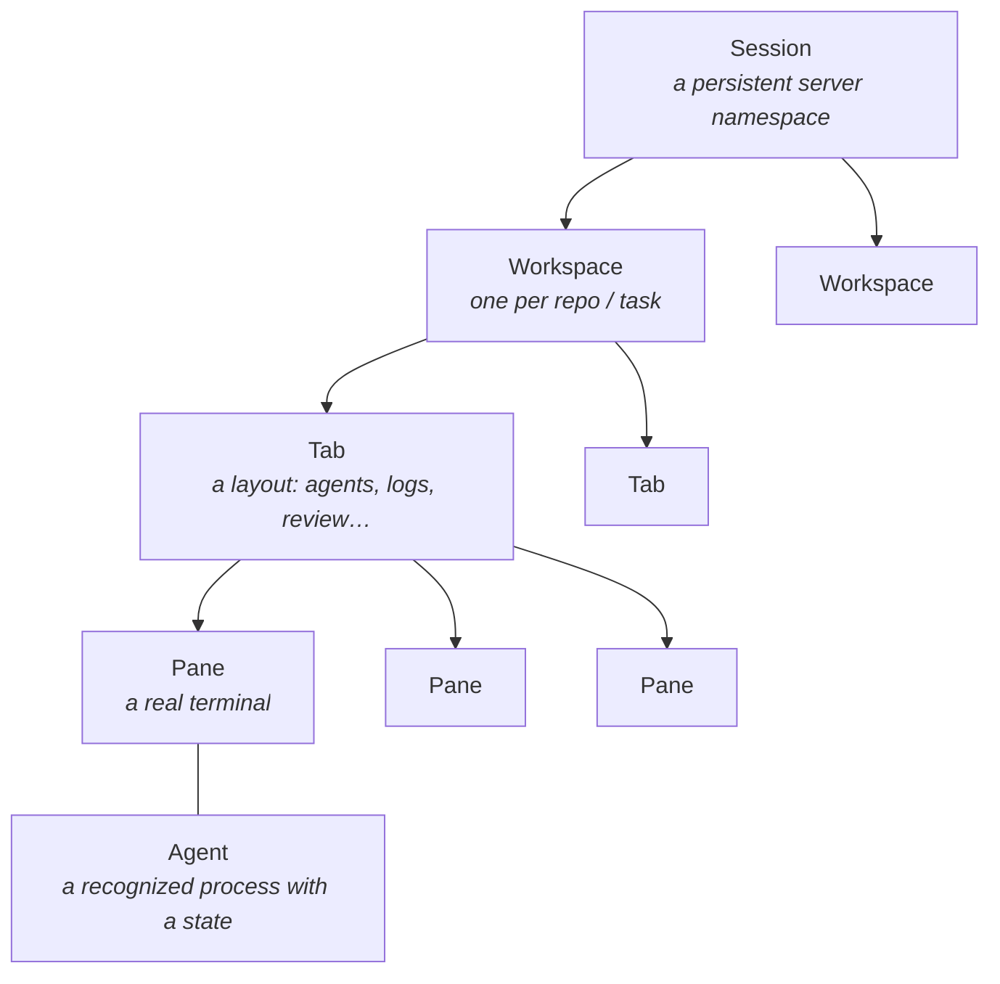
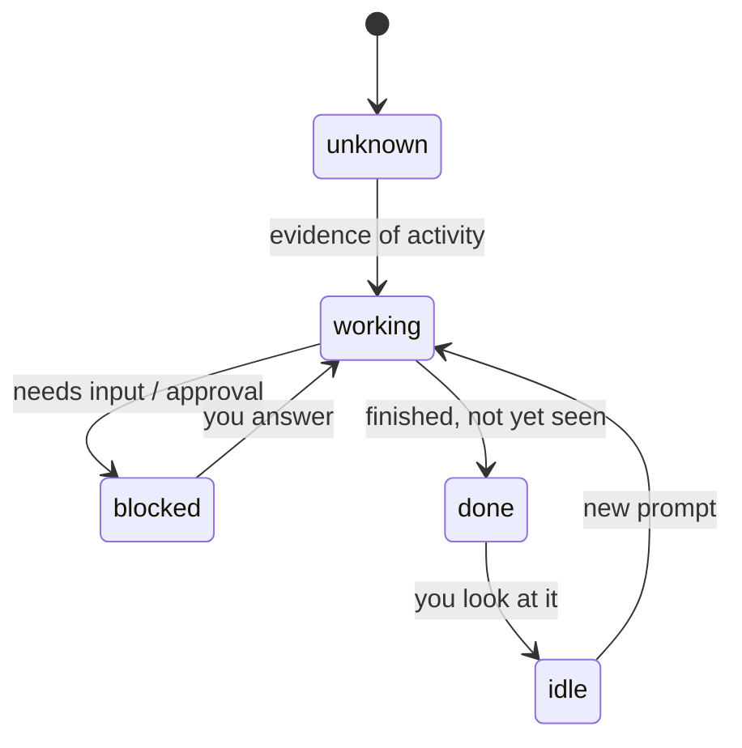
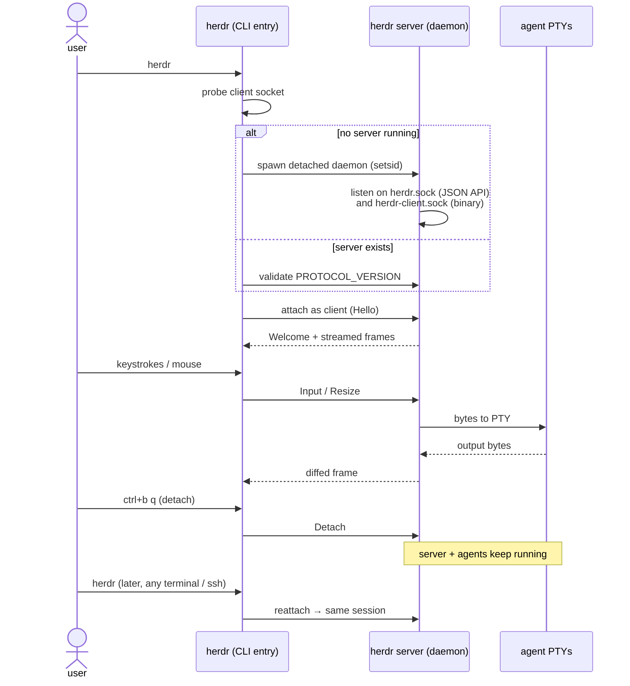
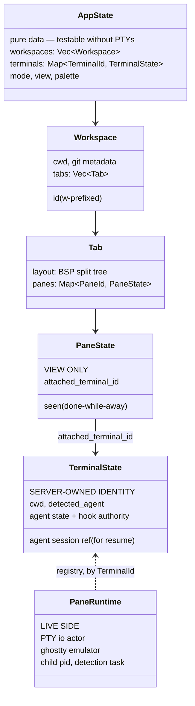
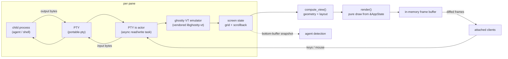
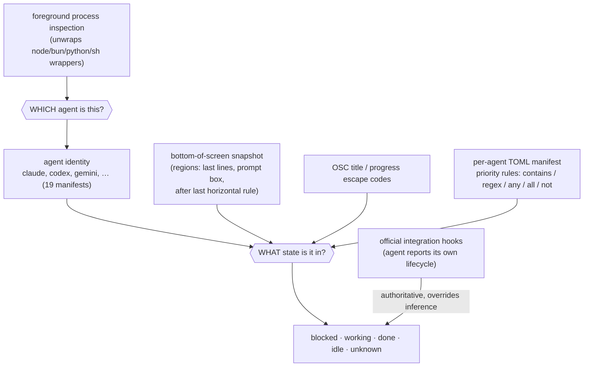
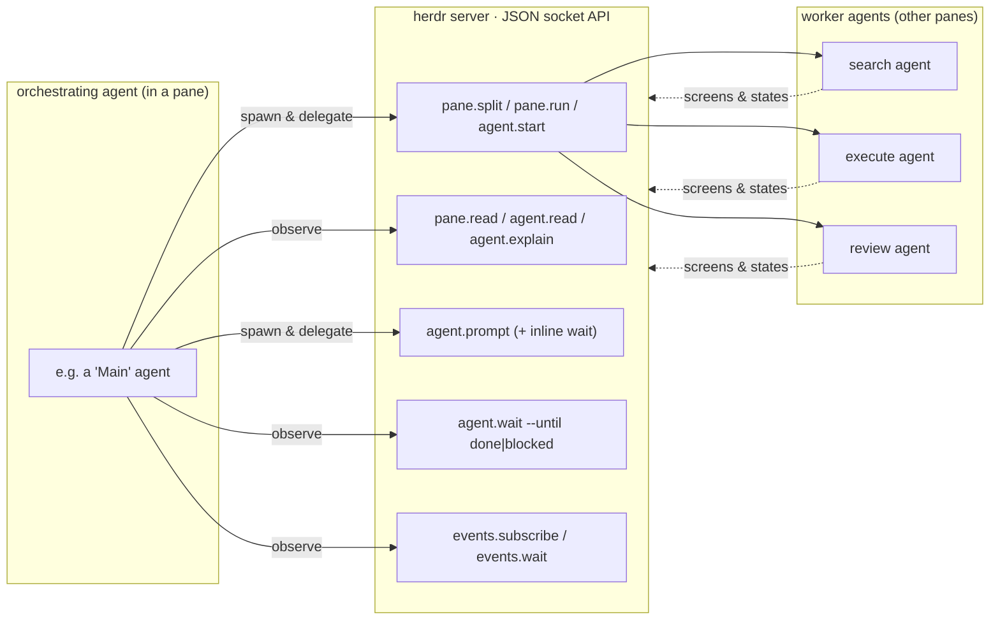
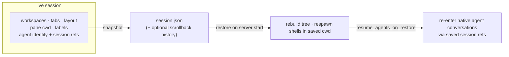
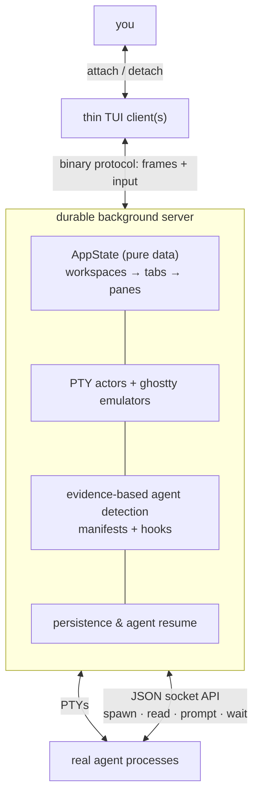

# herdr — a mental map

> A structured mental model of [herdr](https://github.com/ogulcancelik/herdr): what it is, what problem it solves, why its design works, and the core concepts that make the machine tick. Derived from the source tree and docs (Apache-2.0).

---

## 1. What is herdr?

**herdr is an agent multiplexer that lives in your terminal.** Think "tmux, but designed for the era where the processes in your panes are coding agents (Claude Code, Codex, Gemini, opencode, …) instead of just shells."

It is a single Rust binary that:

- keeps **real terminal processes** running in panes (real PTYs, not wrapped interpretations of agent output),
- **detects what each agent is doing** — blocked, working, done — and rolls that up so you can see at a glance which pane needs you,
- **survives detach**: close your terminal, agents keep running; reattach later, even over SSH,
- exposes a **socket API** so agents themselves can spawn panes, read each other's output, and wait on each other,
- is **mouse-first and keyboard-first at the same time** (click/drag/split *and* tmux-style prefix keys).

---

## 2. What problem does it solve?

Running one coding agent is easy. Running **five at once** creates three problems:

| Problem | What it looks like without herdr | herdr's answer |
| --- | --- | --- |
| **Attention routing** | You alt-tab between terminals asking "is it still thinking? is it waiting on me?" One blocked agent silently wastes 20 minutes. | Every pane carries a live state — `blocked`, `working`, `done`, `idle` — rolled up per workspace in a sidebar. You look at *one* screen and know where you're needed. |
| **Session fragility** | Terminal closes, SSH drops, laptop sleeps → agent session gone. | Server/client split. The server owns the PTYs and keeps running; clients are disposable views. Sessions persist across restarts and can resume agent conversations. |
| **Agents can't cooperate** | Multi-agent workflows need bespoke glue: files, polling, copy-paste between terminals. | A JSON socket API + CLI: any agent can `herdr pane run`, `herdr agent read`, `herdr agent wait --until done`. herdr becomes the shared runtime the agents coordinate through. |

The one-sentence framing: **herdr turns "a pile of terminals running agents" into an observable, durable, scriptable runtime.**

---

## 3. Why does it work?

Five design bets, each of which removes a whole class of failure:

### 3.1 Real terminals, not wrappers

Agents run in genuine PTYs rendered by a vendored [libghostty-vt](https://github.com/ghostty-org/ghostty) terminal emulator. herdr never reinterprets or proxies the agent's UI — you see exactly what the agent draws, so nothing an agent can do breaks the view. TUIs, colors, alternate screens, kitty keyboard protocol, images: all just work.

### 3.2 Server owns state; clients are disposable

The `herdr` command you type is just a thin client. A background server owns every pane, process, and byte of state, and streams rendered frames to whoever is attached. Detach is therefore trivially safe — nothing about the running work lives in your terminal window.

### 3.3 Detection is evidence-based and decoupled

Agent state is inferred from **observable evidence** — the bottom of the screen buffer, OSC title/progress, the foreground process — matched against per-agent TOML manifests, not from parsing an agent's private protocol. New agent version changes its UI? Update a manifest (hot-reloadable), not the core. Agents with official integrations skip inference entirely and report state via hooks.

### 3.4 One control surface, three layers

The mouse UI, the CLI (`herdr pane …`, `herdr agent …`), and the raw JSON socket all drive the same server methods. Humans and agents use the *same* verbs, so anything you can do by hand, an agent can automate.

### 3.5 Strict internal boundaries

State is pure data (testable without PTYs), render is pure (never mutates), platform code is quarantined, detection never touches the parser. These invariants keep a concurrent, multi-process system debuggable.

---

## 4. Core concepts (the vocabulary)

- **Session** — a persistent server namespace (own sockets, own persisted state). `herdr` attaches to the default one; named sessions exist for full isolation.
- **Workspace** — top-level project container (use one per repo/task). Its sidebar entry rolls up the states of the agents inside it.
- **Tab** — a layout inside a workspace (BSP split tree of panes).
- **Pane** — a real terminal: PTY + emulator + view. Splittable, addressable (`w1:p2`), readable and writable from the CLI/API.
- **Agent** — a process herdr recognizes inside a pane, with a state machine:

| State | Meaning |
| --- | --- |
| `blocked` | Needs input, approval, or a decision — **go here first** |
| `working` | Actively running |
| `done` | Finished and you haven't looked yet |
| `idle` | Finished/waiting and already seen |
| `unknown` | Can't confidently classify |

---

## 5. How it works — the architecture

### 5.1 Process model: thin client, durable server

Two processes, two Unix sockets. `herdr.sock` speaks line-delimited JSON (the public automation API). `herdr-client.sock` speaks a private binary protocol carrying rendered frames and input (the TUI attachment).

The server is *headless*: it runs the full UI loop and renders into an in-memory buffer even with zero clients attached, then streams diffs to each client. That's why attach/detach is instant and why multiple clients can watch the same session.

### 5.2 Data model: state, identity, and runtime are separated

The key trick in the codebase: **three concerns per terminal, three types, never mixed.**

- **`PaneState`** is just a viewport: "this slot in the layout shows terminal X."
- **`TerminalState`** is the durable fact sheet: what agent lives here, what state it's in, how to resume it.
- **`PaneRuntime`** is the live machinery: the PTY actor and the terminal emulator.

Because `AppState` is pure data, all workspace/layout/identity logic is unit-testable with no PTYs or async — and because panes merely *point at* terminals, terminals can outlive layout changes.

### 5.3 The terminal pipeline: bytes in, frames out

Notable properties:

- **Render is pure.** `compute_view()` does all geometry and mutation; `render()` only draws from `&AppState`. There is exactly one place state changes.
- The same screen state feeds both **rendering** (what you see) and **detection** (what herdr infers) — but detection reads its own bottom-of-buffer snapshot, never the user-scrollable viewport, so scrolling can't confuse it.

### 5.4 Agent detection: how herdr knows an agent is blocked

Two questions, answered from independent evidence:

- **Manifests are data, not code**: `src/detect/manifests/<agent>.toml` files describe visible evidence ("this approval prompt text in the bottom lines ⇒ blocked") with AND/OR gates and priorities. Highest-priority match wins.
- **Hot-reloadable and updatable**: local override files and remote-fetched manifests shadow the bundled ones, so a UI change in an agent can be fixed without shipping a new herdr binary.
- **Hooks beat heuristics**: agents with installed integrations (shell hooks that call back into herdr with `HERDR_PANE_ID`) report state directly and take authority over screen inference.

### 5.5 The socket API: herdr as a runtime *for* agents

The feature that makes herdr more than a multiplexer. Every managed pane gets `HERDR_PANE_ID` / `HERDR_TAB_ID` / `HERDR_WORKSPACE_ID` in its environment, and the CLI/socket lets any process orchestrate the session:

Three layers share one control surface: an **agent skill** (teaches agents the verbs), **CLI wrappers** (`herdr pane run w1:p2 "npm test"`, `herdr agent wait w1:p1 --until done`), and the **raw JSON socket** (~100 dot-notation methods, self-describing via `herdr api schema`). `agent.wait` is server-owned and pins the pane occupant, so a replacement process can't falsely satisfy the wait — the races you'd hit with polling scripts are handled in the runtime.

### 5.6 Persistence: what survives a restart

Structure survives; live processes don't — each pane respawns a fresh shell in its saved cwd. But because integrations persist **agent session references**, herdr can resume the actual agent *conversations* (e.g. a Claude Code session) after a reboot, which is the part users actually care about.

---

## 6. The one-diagram summary

**Mental shortcut:** *tmux gave shells durability; herdr gives agents durability, observability, and a shared API — the server is the runtime, the TUI is just one client of it, and "is my agent blocked?" is a first-class, queryable fact.*

---

## Appendix: where things live in the source

| Area | Path |
| --- | --- |
| Entry / daemon autodetect | `src/main.rs`, `src/server/autodetect.rs` |
| Headless server loop | `src/server/headless.rs` |
| TUI client | `src/client/` |
| State (pure data) | `src/app/state.rs`, `src/workspace/`, `src/pane/state.rs`, `src/terminal/state.rs` |
| Live runtime | `src/pane.rs` (`PaneRuntime`), `src/pty/` (backend + io actor) |
| Terminal emulator | `src/ghostty/` bindings over `vendor/libghostty-vt` |
| Rendering | `src/ui.rs` (`compute_view` / `render`), `src/ui/` |
| Detection engine + manifests | `src/detect/`, `src/detect/manifests/*.toml` |
| Public JSON API | `src/api/` (methods in `src/api/schema.rs`) |
| Private client protocol | `src/protocol/` (`PROTOCOL_VERSION`) |
| Persistence / restore | `src/persist/`, `src/agent_resume.rs` |
| Integrations (agent hooks) | `src/integration/` |
| Platform isolation | `src/platform/<os>.rs` |
